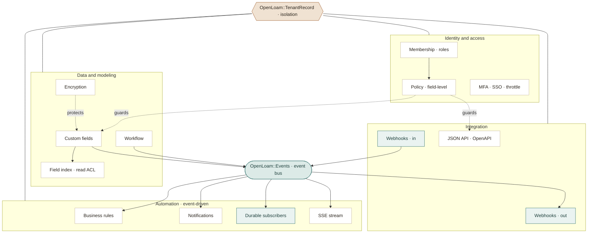
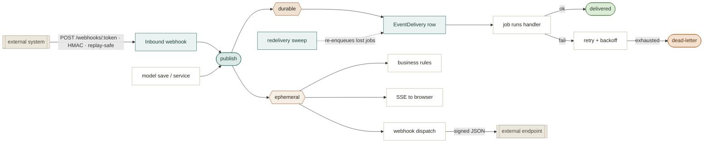

# How OpenLoam works

OpenLoam is an **opinionated foundation, delivered as one Rails engine gem.** Each
pillar — tenancy, authorization, audit, events, admin — is a small,
self-contained implementation living under `OpenLoam::`. The value is the
*fusion*: they all agree with each other and with the tenancy boundary on day
zero, plus an [agent-legibility layer]() on top so
a coding agent doesn't have to rediscover any of it per task.

> **Prototype note (2026-08).** The original plan was to *wrap* proven gems
> (`acts_as_tenant`, `pundit`, `paper_trail`, Rails Event Store, Avo). The
> prototype instead ships **minimal in-gem implementations** behind OpenLoam's own
> conventions — the smallest surface that proves the conventions and the agent
> flow end to end (see [ADR 0002]()).
> Read one at a time against the code, those swaps are now settled: tenancy,
> audit and authorization stay in-gem, and the one real gap — event capture —
> was closed in-gem too
> ([ADR 0007]()). The
> `OpenLoam::` API remains the contract either way.

## Shape

OpenLoam ships as a single Rails **engine** + generators + an `AGENTS.md`
contract, layered over a standard Rails 8 app.

```
app/                     your business (the 20%)
lib/open_loam/                the foundation (the 80%)
  tenant_record.rb       tenant model base class + default-scope isolation
  current.rb             per-request tenant/actor context
  policy.rb              roles + field-level write rules
  auditable.rb           change tracking, on by default
  events.rb / eventful.rb  domain event bus + lifecycle events
  custom_fields.rb       runtime fields (OpenLoam::FieldDefinition + json column)
  workflow.rb            states, transitions, role-gated approvals
  lifecycle.rb           on_tenant_created hooks + open_loam:sync
app/models/open_loam/         engine models (Tenant, Membership, AuditRecord, …)
lib/generators/open_loam/     install + entity generators (the one interface)
AGENTS.md                agent conventions + guardrails (byte-budgeted)
```

## The system, visually

A polished, shareable version of these diagrams (plus the full module
catalogue) lives as an [**architecture map**](https://claude.ai/code/artifact/949311d3-5e14-4f07-a8ad-7b1bb5bd87ad).
The two graphs below are Mermaid — they also render inline on GitHub.

**The module map** — two things sit at the center: `OpenLoam::TenantRecord` (the
ground every model stands on) and the event bus (how modules talk without
knowing about each other). An arrow reads as "feeds" or "builds on".





**The event backbone** — publishing is cheap and knows nothing about who
listens. Subscribers come in two contracts: *ephemeral* (in-process,
best-effort) and *durable* (persisted, retried, at-least-once). External
systems join the same bus from both directions.





## The pillars, briefly

- **Tenant isolation.** Every business model inherits `OpenLoam::TenantRecord`; a
  missing tenant context raises instead of widening a query. Structural, not a
  convention. → [Tenant isolation]()
- **Authorization.** A `OpenLoam::Policy` per entity: role-based action checks
  plus field-level `writable:`/`readable:` rules. Orthogonal to tenancy — a
  member of the right tenant can still be denied a specific action or field.
  → [Authorization]()
- **Audit.** Every create/update/destroy on an audited model writes a
  `OpenLoam::AuditRecord` with actor, action, and changeset — automatically.
  → [Audit trail]()
- **Domain events.** `OpenLoam::Events` over `ActiveSupport::Notifications`;
  *ephemeral* (in-process, best-effort) and *durable* (persisted, retried,
  dead-lettered) subscriber tiers. → [Events]()
- **Admin.** A generated, Hotwire-free ERB console — CRUD, comments,
  attachments, global search, permission-aware — comes with every entity for
  free.

Every other pillar (workflow, custom fields, encryption, MFA, SSO, scheduler,
search, business rules, and the rest) is documented in the
[pillar implementation reference](), with
what the prototype ships versus the roadmap target for each.

## Agent-legibility layer

What makes OpenLoam *agent-native* rather than just a starter kit:

1. **`AGENTS.md`** — the canonical map, byte-budgeted (≤32 KB, enforced by a
   [guardrail]()) so an agent harness never
   silently truncates its tail. → [The agent contract]()
2. **Generators as the interface** — agents add features by invoking OpenLoam
   generators, not free-form file creation. Output is predictable and
   reviewable. → [Generators]()
3. **Structural guardrails** — tenancy and authorization are enforced by base
   classes and default scopes, so an agent *can't* silently produce a
   cross-tenant leak or an unauthorized action; it shows up as a failing test.
   → [Guardrails]()
4. **Measured** — a golden-tasks benchmark runs agents against fresh apps and
   audits the result behaviorally, not just by test count.
   → [Golden tasks]()

## Example: what "add a feature" looks like

> "Add a `Subscription` entity: fields plan, status, renews_at; tenant-scoped;
> admin screen; only Billing role can edit; emit `billing.subscription.renewed`."

An agent (or human) runs the entity generator, declares the policy rule, adds
the workflow/event, and the admin panel comes with it — each a conventional,
audited, tenant-scoped step. No decisions about *how* tenancy or permissions
work, because OpenLoam already decided. This is exactly the shape the
[golden-tasks benchmark]() exercises.

## Non-goals

- Not a commerce product (that's Spree/Solidus) — OpenLoam is domain-agnostic.
- Not a low-code builder — it produces normal, readable Rails code.
- Not a fork of Rails — it's an engine + conventions on top of stock Rails.

## Decisions made in the prototype

The bigger calls are recorded as ADRs: [row-level tenancy](),
[in-gem implementations before wrapping proven gems](),
[a generated ERB admin](),
[the byte-budgeted AGENTS.md contract](),
and [events as the decoupling seam](). A few smaller
calls aren't ADRs yet, in brief:

- **Custom-fields engine** → a json column + `FieldDefinition` typed accessors,
  not full EAV. Portable `json` today; `jsonb`/GIN is the production target; a
  read-model index (`OpenLoam::CustomFieldIndex`) is the scaling path.
- **Encryption at rest** → AES-256-GCM with a random 12-byte IV per value,
  version-tagged so a rotated key or new scheme can coexist with old rows.
  Keys derive per tenant AND per purpose via HKDF-SHA256 from one master key,
  behind a `KeyProvider` seam a Vault/KMS provider can drop into.
- **MFA key scope** → an MFA secret is keyed by the *user*, not the tenant —
  it must verify at login before any tenant is chosen, so a per-tenant key
  would be a lockout bug.
- **Approval gate** → a staging primitive (`OpenLoam::PendingActions.stage`), not
  a global Active Record interceptor — OpenLoam has no single write chokepoint, so
  a confirm-mode caller checks `OpenLoam.require_confirmation?` and stages
  explicitly. See [Confirm-mode]().
- **Real-time push is single-process in the prototype.** The default SSE
  broadcaster only sees events instrumented in its own process — correct for
  the single-worker prototype, and a documented seam (`OpenLoam::EventStream.broadcaster`)
  for a Redis/SolidCable backend at multi-process scale.
