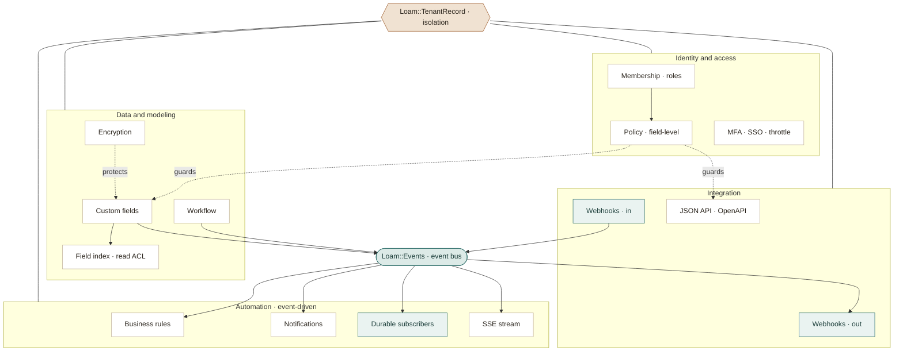
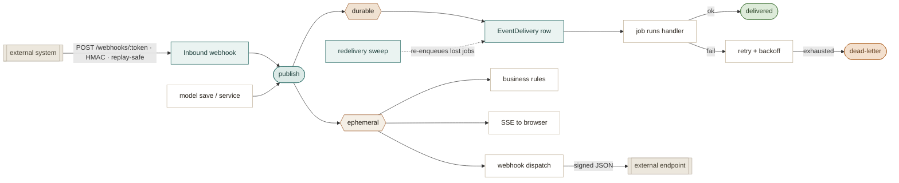

# Loam — architecture

Loam is an **opinionated foundation, delivered as one Rails engine gem.** Each
pillar is a small, self-contained implementation living under `Loam::`; the
value is the *fusion* — that they all agree with each other and with the
tenancy boundary on day zero — and the *agent-legibility layer* on top.

> **Prototype note (2026-08).** The original plan was to *wrap* proven gems
> (`acts_as_tenant`, `pundit`, `paper_trail`, Rails Event Store, Avo). The
> prototype instead ships **minimal in-gem implementations** behind Loam's own
> conventions — the smallest surface that proves the conventions and the agent
> flow end to end. Swapping the proven gems back in *behind the same public
> conventions* is the roadmap (backlog L-201..L-204), not a reversal: the
> `Loam::` API is the contract, its internals are replaceable.

## Shape

Loam ships as a single Rails **engine** + generators + an `AGENTS.md`
contract, layered over a standard Rails 8 app.

```
app/                     your business (the 20%)
lib/loam/                the foundation (the 80%)
  tenant_record.rb       tenant model base class + default-scope isolation
  current.rb             per-request tenant/actor context
  policy.rb              roles + field-level write rules
  auditable.rb           change tracking, on by default
  events.rb / eventful.rb  domain event bus + lifecycle events
  custom_fields.rb       runtime fields (Loam::FieldDefinition + json column)
  workflow.rb            states, transitions, role-gated approvals
  notifications.rb       tenant-scoped in-app notifications
  webhooks.rb            per-tenant signed outbound delivery
  commentable.rb / attachable.rb   comments + ActiveStorage attachments
  searchable.rb          declared search + index filtering
  lifecycle.rb           on_tenant_created hooks + loam:sync
app/models/loam/         engine models (Tenant, Membership, AuditRecord,
                         FieldDefinition, Notification, ApiToken, WebhookEndpoint, Comment)
lib/generators/loam/     install + entity generators (the one interface)
AGENTS.md                agent conventions + guardrails (byte-budgeted)
```

## The system, visually

A polished, shareable version of these diagrams (plus the full module
catalogue) lives as an [**architecture map**](https://claude.ai/code/artifact/949311d3-5e14-4f07-a8ad-7b1bb5bd87ad).
The two graphs below render on GitHub.

**The module map** — two things sit at the center: `Loam::TenantRecord` (the
ground every model stands on) and the event bus (how modules talk without
knowing about each other). An arrow reads as "feeds" or "builds on".



**The event backbone** — publishing is cheap and knows nothing about who
listens. Subscribers come in two contracts: *ephemeral* (in-process,
best-effort) and *durable* (persisted, retried, at-least-once). External
systems join the same bus from both directions.



## Pillars → how they're built

| Pillar | Prototype implementation | Roadmap target |
|--------|--------------------------|----------------|
| **Multi-tenancy** | `Loam::TenantRecord` with a `default_scope` on `Loam::Current.tenant`; a missing tenant **raises** `MissingTenantError` rather than widening the query. Row-level, `tenant_id` on every scoped table. | evaluate `acts_as_tenant` behind the same base class (L-201) |
| **Authorization** | `Loam::Policy` — a policy class per entity, role from `Loam::Membership`, field-level `writable:` rules enforced in the controller permit list. | wrap `pundit`'s policy objects (L-202) |
| **Custom fields** | A `custom_fields` **json** column + runtime `Loam::FieldDefinition` rows; typed read/write, admin-managed, no migration. **L-703 (done):** `Loam::CustomFieldIndex` + `Loam::CustomFieldValue` — a typed-EAV read model (one indexed row per record×field, `value_text`/`value_number`/`value_boolean`/`value_datetime`) so filter/sort/search is index-backed, not a JSON scan. Maintained from the `Loam::CustomFields` save/destroy hooks (re-project only when `custom_fields` changed; soft-delete keeps rows, the base scope hides the record); `field_key` must be a real `FieldDefinition`; tenant-scoped throughout. `filter(model, key, op, value)` / `order` return a relation the admin index (`cf_*` params) and perspectives route through; `loam:index:reindex` backfills. **L-919 (done) — trust at scale:** `coverage(model, field_key)` reports indexed-vs-expected (a JSON pass, so a periodic readout — `loam:index:coverage`); a read over an INCOMPLETE index serves an authoritative JSON-scan fallback (CORRECTNESS over speed — never a silently-partial set), sets `partial?` (the admin shows "results may be incomplete, reindexing…"), and enqueues a DEDUPED `Loam::CustomFieldReindexJob` to self-heal (in-process dedup marker; a DB/cache marker is the multi-process path). Cross-entity denormalized joins are DEFERRED (a note — the least-essential of the four L-919 deltas). **L-711 (done) — read ACL:** a `FieldDefinition` can declare `readable_roles` (mirrors `writable_roles`); `filter`/`order` refuse a field the current role may not read (`Loam::FieldAccessError` → 403), so a filter can't be an inference oracle on a restricted value (empty roles = any member; a system/no-actor context is trusted). | numeric-aware ORDER BY; a generation-stamp for O(delta) reprojection; cross-entity join; Postgres `jsonb`/GIN |
| **Event backbone** | `Loam::Events` over `ActiveSupport::Notifications`; `domain.thing.happened` naming, tenant/actor stamped on every payload. **L-706 (done) — the formal two-tier contract:** *ephemeral* (`Events.subscribe`, inline/best-effort, exception propagates to the publisher) vs *durable* (`Loam::DurableEvents.register(key:, to:, call:)`) which persists a `Loam::EventDelivery` row in the event's tenant and runs the handler in a job with row-state retries + backoff, parked `dead` past `MAX_ATTEMPTS`. Durability is the row + a per-tenant `EventRedeliverySweepJob`, not the queue (survives a lost job / crashed worker / async-adapter txn race); at-least-once, handlers idempotent; a dead-letter admin view requeues; handlers resolve from the boot registry, never constantized from the row. See `docs/agents/events.md`. | wrap Rails Event Store behind the same contract (L-204) |
| **Workflow** | `Loam::Workflow` DSL — states with inclusion validation, transitions with `from`/`to`/`roles`, generated bang methods, transition events. | undo/redo command layer (L-704) |
| **Audit** | `Loam::Auditable` — `after_commit` writes a tenant- and actor-tagged `Loam::AuditRecord` with the changeset. | wrap `paper_trail` (L-203) |
| **Soft-delete** | `Loam::SoftDeletable` — a `deleted_at` column and a second `default_scope` that composes with tenancy; deleted rows are excluded by default, `with_deleted` lifts only the `deleted_at` filter (never tenancy), and `soft_delete`/`restore` reuse the audit path. | wrap `discard`/`paranoia` behind the same concern (L-902) |
| **Settings** | `Loam::Configs` over a `Loam::Config` table (nullable `tenant_id` = global vs. per-tenant override, JSON value); resolves override → global → declared default, memoized per request in `Loam::Current`. | Rails.cache-backed shared layer behind the same API (L-906) |
| **Feature flags** | `Loam::Features` — a thin boolean wrapper over `Loam::Configs` under the reserved `features.` key prefix; `on?`/`enable`/`disable`/`reset`, a `feature_defaults` registry, and `require_feature!` (404) / `feature_on?` guards. Gates a capability, orthogonal to policy. | percentage / gradual rollout (L-905) |
| **Encryption at rest** | `Loam::Encryptable` — `encrypts :field` seals with AES-256-GCM under a per-tenant key (`Loam::Encryption`), decrypts on read, keyed by `Loam.tenant!` so a wrong-context read fails the auth tag. Keys derive via HKDF-SHA256 from one master key behind a `KeyProvider` seam. `searchable: true` adds an HMAC blind index for exact-match lookup; audit changesets redact encrypted fields to `[encrypted]`. Each ciphertext is BOUND to its (tenant, table, column) via AES-GCM **AAD** (the `v2:` format), so a blob transplanted to another column/table/tenant fails the auth tag — old `v1:` blobs (no AAD) stay readable, and `loam:encryption:rotate` upgrades v1→v2. Record-swap within one tenant+table+column is a documented residual (the id isn't known at INSERT to bind cheaply). | Vault/KMS `KeyProvider`, record-id AAD binding, encrypted custom_fields |
| **MFA & step-up** | `Loam::Totp` (RFC 6238, hand-rolled on OpenSSL) + `Loam::MfaCredential` — a per-user TOTP secret encrypted under a `user/<id>` key (so it verifies at login before any tenant is chosen) and BCrypt-hashed single-use recovery codes. Login gains a second-factor step; `require_sudo!` re-challenges sensitive actions within a 5-min window; `security.mfa_required_roles` (via `Loam::Configs`) forces enrollment. **Rate-limiting/lockout** (`Loam::AuthThrottle` + `Loam::AuthAttempt`, a global non-tenant DB counter): failed password/TOTP/sudo attempts lock an identifier after N-in-a-window (Configs: `security.max_auth_attempts`/`auth_window_minutes`, defaults 10/15). Throttled by the SUBMITTED identifier whether or not the account exists, with an identical generic 429 response — so a lockout is not an existence oracle; a success clears the counter; the window query is the expiry (no reaper). Per-identifier is the primary defense (an optional per-ip knob rides the same store). | WebAuthn/passkeys, QR rendering; Rack::Attack + cache store for multi-process rate-limiting |
| **AI approval gate** | `Loam::PendingActions` + `Loam::PendingAction` — a `TenantRecord` composing Workflow (approval IS a role-gated `pending → approved → executed` machine), Auditable, and Encryptable (the proposed `changeset` is encrypted at rest so it can't leak through the audit). `stage` records intent without touching the target; `approve!(by:)` executes in a transaction as the approver. Loam does NOT intercept Active Record — this is the primitive a confirm-mode caller invokes. | the human-in-the-loop consumer is the MCP server (L-302) |
| **Saved views** | `Loam::Perspectives` + `Loam::Perspective` — a tenant-scoped, audited saved index view (filters/sort/columns/page_size in a json `config`) with private / role / tenant visibility resolved by an `.or` chain; `default_for` picks the most specific default (private > role > tenant). `apply` filters/sorts only whitelisted columns (never `tenant_id`/plumbing), and rows are optimistic-locked. | column-level RBAC on view sharing; a richer in-index column/filter builder |
| **Concurrent-edit safety** | Optimistic: `lock_version` on every generated entity; a stale update raises `StaleObjectError`, which the admin controller turns into a diff-and-retry conflict page (`stale_conflict!`, encrypted fields compared decrypted). Advisory: `Loam::RecordLock` + `Loam::RecordLocks` — a TTL'd per-record "who's editing" lock (heartbeat on re-acquire, auto-free on soft-delete, manager `force_release`). The version check is the guarantee; the lock is the courtesy. | presence/websocket live-lock UI; server-side field-merge on conflict |
| **Real-time updates** | `Loam::EventStream` — a `text/event-stream` endpoint (`ActionController::Live`) that pushes events matching `Loam.broadcast_events` (default OFF) to the browser, tenant- and audience-filtered; a vanilla `EventSource` in the layout updates the bell live. Fan-out is behind a swappable broadcaster seam. | Redis/SolidCable broadcaster for multi-process (see the single-process note below) |
| **Response enrichers** | `Loam::Enrichers` — a process-global registry (`register(entity_type, key:, batch:)`) whose `enrich`/`enrich_many` attach computed cross-module blocks under an `enrichments` key in admin/API responses, with no FK coupling. `batch:` resolvers make an index one query, not N; a raising enricher is isolated (key omitted); resolvers run in the current tenant scope. | timeout/circuit-breaking a slow enricher; column-level RBAC on enrichment output |
| **Business rules** | `Loam::BusinessRules` + `Loam::BusinessRule` (audited `TenantRecord`) — admin-editable WHEN/THEN rules. A wildcard event subscriber (registered once at boot, `Events.subscribe_all`) finds active rules whose `trigger` pattern-matches the event, loads the subject, and runs matching rules **tenant-scoped, in priority order, each isolated** (a raising rule is logged, never breaks dispatch or siblings). The condition is a **safe evaluator** — a `{field, op, value}` tree (`and`/`or`/`not`) read via `Condition` against a whitelist of real columns + custom fields, refusing `tenant_id`, encrypted columns, and unknown fields; **no `eval`/`send`, values are literals** (same posture as the Saved-views filter whitelist). Actions are a fixed vocabulary (`Actions`): `notify`, `emit_event` (name validated), `set_field` (whitelisted attr/custom field — **refuses the workflow status column**, which would bypass the transition gate), `block_transition` (a `veto?` an entity opts into from `loam_perform_transition!`). A thread-local depth guard (`MAX_DEPTH`) bounds self-triggering; a capped `Loam::BusinessRuleRun` log records matched/actions/errors. | `call_webhook` action; a visual condition/action builder; scheduled (non-event) triggers |
| **Pluggable search** | `Loam::Search` — a driver seam (`Loam::Search.driver = ...`, like `EventStream.broadcaster`). `Loam::Searchable#search` delegates to `driver.search(self, q, scope: all)`, so `searchable_by` and every call site are unchanged. `LikeDriver` (default) is the original substring LIKE; `TokenDriver` normalizes each record's searchable text into `loam_search_tokens` (a `TenantRecord`, so the match subquery is tenant-scoped for free) and matches with AND semantics via `GROUP BY … HAVING COUNT(DISTINCT token) = N` — portable (SQLite + PG), word-level, order-independent. `after_save`/`after_destroy` maintain the index; soft-deleted rows drop out via the base scope; an **encrypted column is never tokenized** (the L-901 boundary). `loam:search:reindex` backfills. | a Meilisearch/Elasticsearch driver behind the same seam; prefix/fuzzy matching; relevance ranking |
| **SSO (OIDC)** | `Loam::Sso` + `Loam::SsoProvider` (per-tenant, `client_secret` encrypted under the tenant key) + `Loam::SsoIdentity` (the durable `sub`↔User link). **Shipped:** OIDC Authorization Code flow end-to-end — home-realm discovery by email domain (`provider_for`, a blessed cross-tenant `unscoped` lookup like `Membership.tenants_for`), JIT provisioning + account linking (by `sub` first, then verified email), IdP group→role mapping. Wired into the existing SessionsController (`sso_start`/`sso_callback`), so MFA and the tenant flow still apply. Protocol providers sit behind a `builder` seam (`authorization_url`/`exchange` → normalized `Claims`); `OidcProvider` uses discovery + the userinfo endpoint (back-channel TLS, client-secret-authenticated — no hand-rolled JWKS for the prototype). **Safety:** an unverified email is refused (no takeover); `state` is the callback CSRF check; the client secret is never rendered back. **Offline by design:** tests/demo inject `FakeProvider` via the builder, so no test touches the network; `OidcProvider` is never constructed in the suite. | **Seams:** SAML (raises `NotImplementedError` behind the same interface until built); SCIM 2.0 provisioning (RFC 7644 — a `/scim/v2` Users/Groups endpoint with bearer auth for IdP-pushed lifecycle; not built); full id_token + JWKS validation |
| **Dictionaries** | `Loam::Dictionary` + `Loam::DictionaryEntry` (both `TenantRecord`, audited) — per-tenant managed lookup lists. `Loam::Dictionaries` is the read API (`get`/`entries`/`default`/`label_for`), memoized per request in `Loam::Current.dictionary_cache` keyed with the tenant id (same posture as Configs). Integrates with custom fields: a `Loam::FieldDefinition` of `field_type: "dictionary"` stores the dictionary key in its `config` json; the shared `loam/custom_fields/_fields` partial renders a select of the active entries and shows the entry label on read, while the stored value stays the plain code. | reorder UI beyond a position field; per-entry validation/constraints; dictionary-typed API serialization of labels |
| **Task progress** | `Loam::Progress` + `Loam::ProgressJob` (`TenantRecord`, deliberately NOT audited — progress is high-frequency churn). `start`/`advance(by:, message:)`/`complete!`/`fail!`/`cancel!`; computed `percent`/`eta_seconds`/`stale?`. Each meaningful change publishes `loam.progress.updated` (added to the default `broadcast_events`), delivered live over the L-908 SSE bridge — the frame's `safe_payload` carries only id/percent/status. The broadcast is THROTTLED to once per whole percent (persist every tick, push ~100 frames not 10k). Cancel is cooperative (`cancelled?` re-reads the status column); `stale?` flags a dead-heartbeat job (a reaper is roadmap). | a reaper daemon for stale jobs; batched persistence for very high-volume jobs; pause/resume |
| **Scheduler** | `Loam::Scheduler` + `Loam::ScheduledJob` (`TenantRecord`, audited) + `Loam::Cron` (stdlib 5-field cron + `interval:N`, timezone-aware, no gem). `register` is a declarative registry (like `broadcast_events`); `sync_tenant` materializes tenant-scope defaults per tenant from `on_tenant_created`/`loam:sync`. `tick` (rake `loam:scheduler:tick`, cron-driven) does an **atomic claim** so no two workers double-fire: Postgres `SELECT … FOR UPDATE SKIP LOCKED`, SQLite a transactional claim (single-process-correct for the prototype); a `locked_until` stamp frees a crashed worker's rows after the TTL. Cross-tenant scan is a blessed `unscoped` (the runner has no tenant). **Code-exec guard:** `job_class` must resolve to a real `ActiveJob::Base` subclass (validated at save AND enqueue) — never arbitrary constantize-and-perform. Tenant jobs enqueue with `tenant_id:` under `as_tenant`; system jobs once. Failure-isolated per job. | a resident daemon / in-process scheduler; a distributed advisory-lock claim; per-run history rows |
| **Bulk import / export** | `Loam::Export` (policy/encryption-aware CSV of a tenant-scoped relation — readable columns only, encrypted fields → `[encrypted]`, blind-index columns dropped), `Loam::Import` (a mapping engine: `preview`/`allowed_targets`/`run(dry_run:, progress:)`/`error_csv`, per-row save with a skipped-row error log, update-or-create by a match key, whitelisted targets + `allowed_model` guard so no crafted mapping/entity_type escapes the policy), `Loam::Bulk` (soft-delete / set-field / export-selected, policy-checked per record, ids resolved through the tenant scope). Policy gained a field-level `readable?`. Import runs as a background job advancing a `Loam::ProgressJob` (its `result` json holds the summary). `csv` is a gem dependency (left Ruby's default gems in 3.4). | streaming export for very large sets; async bulk over huge selections; a saved import-mapping profile |
| **Configurable dashboard** | `Loam::Widgets` (a process-global registry — `register(key:, title:, roles:, &block)`; built-ins registered from the engine at boot) + `Loam::Dashboard` (`for(actor:, role:)` → ordered, role-visible, resolved widgets) + `Loam::DashboardWidget` (`TenantRecord`, audited — a tenant's chosen widgets/order). A widget is a DATA PROVIDER (returns `{kind:, ...}`), never arbitrary code; the `roles:` filter is enforced server-side so a hidden widget's provider is NOT called (no data computed/sent); a raising provider is isolated into an error tile (like enrichers/rules); queries run tenant-scoped. The dashboard falls back to the full registered set when a tenant has configured none. | drag-reorder UI; per-role default layouts; a general injection-slot framework (L-922); richer widget partials/charts |
| **Auto OpenAPI** | `Loam::OpenApi` — introspects the app into an OpenAPI 3.1 `document` (and a `markdown` rendering), no annotations/gem. Discovery: `TenantRecord` descendants that have an `Api::<Plural>Controller` (matched via `model_name.plural`, which handles the uncountable `equipment`). Encodes the `bearerAuth` scheme (Loam::ApiToken), a component schema per entity (columns→OpenAPI types, custom fields, read-only id/timestamps), a separate `*Input` request schema of writable fields only (never id/tenant_id/plumbing), the 5 CRUD paths, and the tenancy guarantee in `x-tenancy`/descriptions. **Field-level policy** is per-role/runtime, so the structural schema documents it in a description rather than emitting a schema per role. Encrypted fields are typed `string` (shape, never values). Served at `/admin/api_docs` (a plain server-rendered explorer — no Swagger-UI/external JS, CSP-safe) with a `.json` format; `loam:openapi:export` writes it to disk. | per-operation examples; response pagination metadata; a public (tokened) `/api/openapi.json` |
| **Content translations** | `Loam::Translatable` (`translates :name`) + `Loam::Translation` (`TenantRecord`, audited, polymorphic, unique per record+locale+field). The declared field's reader is redefined to OVERLAY: `loam_translation_value(field, locale) || read_attribute(field)` — the base column is the fallback and stays authoritative (writes go through the ordinary `name=`, so translations are purely additive; the base is never lost). Locale is request state: `Loam::Current.locale` (a switcher `before_action`), with `Loam.locales`/`Loam.default_locale` registries. **Encrypted fields refuse `translates` at class load** (a translation row would store plaintext — the same posture as `searchable_by`). Distinct from Rails i18n (developer UI strings). Per-record admin screen at `/admin/translations`. | inline editing on the entity form per locale; translation completeness reporting; a fallback-locale chain |
| **Override registry** | `Loam::Overrides` — a thin uniform front over Loam's OWN keyed registries: `disable(registry, key)` / `replace(registry, key) { … }`, consulted at resolve time by each registry. Wired: `:widgets` (Widgets.resolve skips disabled, uses the replacement provider) and `:broadcast_events` (EventStream.broadcastable? skips a disabled pattern). `check!` (run from the engine at boot) warns about STALE overrides — a key not present in the live registry — the real delta over monkeypatching, so a typo isn't a silent no-op. `snapshot`/`restore` for test discipline. **Explicit boundary (documented, enforced by scope):** structural pieces — views, controllers, routes — are overridden the Rails way (path-shadowing / `prepend`), NOT here; single-object seams (`Search.driver=`, `EventStream.broadcaster=`) are swapped by assignment. Overrides only unifies the keyed registries where path-shadowing doesn't reach. | wire more registries (enrichers, scheduler, feature/config defaults) into disable/replace as needs arise; per-tenant overrides |
| **Notifications / API / webhooks** | `Loam::Notifications`, a token-auth JSON API per entity, `Loam::Webhooks` with HMAC-signed **outbound** ActiveJob delivery. **L-710 (done) — inbound:** `Loam::InboundWebhooks` + `Loam::InboundWebhookSource`/`InboundWebhookDelivery` — a public `POST /webhooks/:token` receiver (`ActionController::API`). `ingest` runs cheapest-first: body size (413) → token resolve (404, blessed cross-tenant like `ApiToken.authenticate`) → constant-time HMAC over the RAW body (401) → optional timestamp window (401) → `(source_id, external_id)` dedupe (200 idempotent, race-safe via the unique index) → row+publish in one txn (202). Every auth failure is a uniform bare 401 (no oracle); the verified body lives on the delivery row so the published event stays scalar-clean and durable subscribers read it. See `docs/agents/inbound-webhooks.md`. | encrypt the source secret at rest; a `loam:inbound:prune` retention task |
| **Admin** | Generated Hotwire-free ERB console: CRUD, comments, attachments, global search, filtering, pagination, permission-aware. | evaluate Avo as an alternate backend (L-403) |
| **Background** | ActiveJob (webhook delivery, digests); tenant context carried explicitly in jobs via `Loam.as_tenant`. | Solid Queue defaults |

Nothing here is exotic — that's the point. A new project gets all of it
**wired together and agreeing with each other** on day zero.

## Agent-legibility layer

What makes Loam *agent-native* rather than just a starter kit:

1. **`AGENTS.md`** — the canonical map: where entities/policies/events/screens
   live, the one way to add each, and the invariants an agent must not break
   (tenancy, authorization). Byte-budgeted (≤32 KB, enforced by a guardrail
   test) so an agent harness never silently truncates its tail.
2. **Generators as the interface** — agents add features by invoking Loam
   generators (`rails g loam:entity Subscription ...`), not free-form file
   creation. Output is predictable and reviewable.
3. **Structural guardrails** — tenancy and authorization are enforced by base
   classes and default scopes, so an agent *can't* silently produce a
   cross-tenant leak or an unauthorized action; it shows up as a failing test.
   A lint fails on any non-scoped business model or any `.unscoped` in `app/`.
4. **Measured** — a golden-tasks benchmark (`ai/`) runs agents against fresh
   apps and audits the result. First run: 10/10 tasks, zero isolation or
   authorization violations, versus 1/10 isolation on a vanilla-Rails control.
5. **Spec-first flow** *(roadmap, L-708)* — an agent writes a short spec,
   generates scaffolding, fills the business logic, conventions keep it inside
   the lines.

## Example: what "add a feature" looks like

> "Add a `Subscription` entity: fields plan, status, renews_at; tenant-scoped;
> admin screen; only Billing role can edit; emit `billing.subscription.renewed`."

An agent (or human) runs the entity generator, declares the policy rule, adds
the workflow/event, and the admin panel comes with it — each a conventional,
audited, tenant-scoped step. No decisions about *how* tenancy or permissions
work, because Loam already decided. This is exactly the shape the benchmark
exercises.

## Non-goals

- Not a commerce product (that's Spree/Solidus) — Loam is domain-agnostic.
- Not a low-code builder — it produces normal, readable Rails code.
- Not a fork of Rails — it's an engine + conventions on top of stock Rails.

## Decisions made in the prototype

The original open questions, now resolved (revisit if real usage argues otherwise):

- **Tenancy strategy** → row-level (`tenant_id` + `default_scope`), missing
  context raises. Not schema-per-tenant.
- **Custom-fields engine** → json column + `FieldDefinition` typed accessors,
  not full EAV. Portable `json` today (SQLite demo); `jsonb`/GIN in production;
  a read-model index is the scaling path (L-703).
- **Admin** → a generated ERB console (control over a dependency) for now; Avo
  left as an evaluated alternative (L-403).
- **Agent pack** → a Loam-specific `AGENTS.md` contract, byte-budgeted, with a
  golden-tasks benchmark rather than a reused third-party convention set.
- **Encryption at rest** → AES-256-GCM (authenticated) with a random 12-byte IV
  per value, stored version-tagged (`v1:base64(iv‖tag‖ciphertext)`) so a rotated
  key or new scheme can coexist with old rows. Keys are derived per tenant AND
  per purpose (encryption vs. blind index) via HKDF-SHA256 from one master key,
  behind a `Loam::Encryption::KeyProvider` seam — the HKDF provider ships, a
  Vault/AWS-KMS provider drops in with no call-site change. Deterministic HKDF
  means no key storage but also no per-key rotation yet; the version tag is the
  hook for it. Searchable encrypted fields carry an HMAC-SHA256 blind index
  (equality leaks within a tenant, never across — the accepted trade-off).
  Out of scope for now: encrypting the `custom_fields` json.
- **MFA key scope** → the encryption key is scoped by a namespaced owner string
  (`tenant/5` for entity fields, `user/12` for a user's MFA secret), not hard-wired
  to the current tenant. MFA belongs to the person and is verified at login before
  any tenant is chosen, so a per-tenant key would be a lockout bug; the `scope:`
  option on `encrypts` keys it to the user instead. TOTP is hand-rolled on OpenSSL
  (RFC 6238, verified against the RFC vectors) rather than adding a gem. Deferred:
  WebAuthn/passkeys as a second factor and QR-image rendering (the otpauth URI ships).
- **Approval gate** → a staging primitive (`Loam::PendingActions.stage` records a
  `PendingAction` without mutating the target), NOT a global Active Record
  interceptor — auto-gating every save would be fragile, and Loam has no single
  write chokepoint. A confirm-mode caller (an MCP tool, L-302) checks
  `Loam.require_confirmation?` and stages instead of saving; the demo wires one
  path (a proposed price change) explicitly. Approval reuses `Loam::Workflow` as a
  role-gated state machine, and the proposed changeset is encrypted at rest so a
  staged change to an encrypted field never leaks through the row or its audit.
- **Real-time push is SINGLE-PROCESS in the prototype.** The default
  `Loam::EventStream::InProcessBroadcaster` subscribes to `ActiveSupport::Notifications`
  in ONE process, so it only sees events instrumented in that same process — fine
  for the SQLite/single-`puma`-worker prototype, wrong for a multi-process deploy
  where a browser connected to worker A would miss an event published on worker B.
  The fix is a pub/sub backend (Redis, or ActionCable/SolidCable); it drops in as
  a `Loam::EventStream.broadcaster` replacement with no controller change — the
  seam is deliberate, the distribution is not faked. Broadcasting is opt-in per
  `Loam.broadcast_events` pattern (default empty), and every event is filtered to
  the connection's tenant and audience before it leaves the server.
